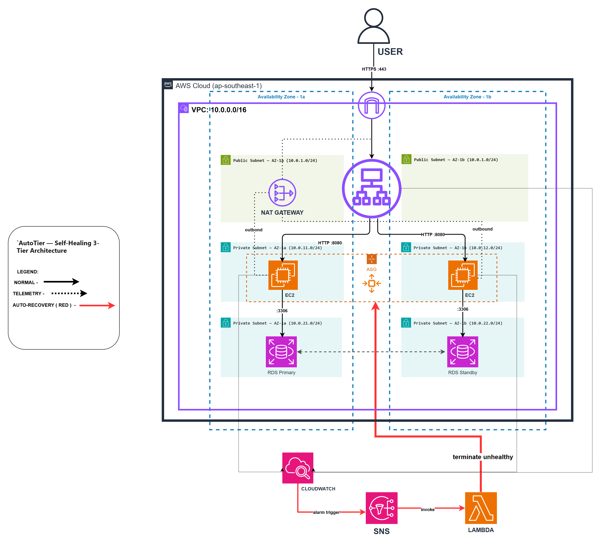

# AutoTier

**Self-healing 3-tier infrastructure on AWS that recovers from failures without human intervention.**

> Part 2 of a 4-project Cloud/DevOps portfolio ([CLOUD2026](https://github.com/jeianjaz)).
> Previous: [CloudDeck](https://github.com/jeianjaz/project-1-self-deploying-portfolio) — serverless portfolio.

---

## Architecture



*Red paths trace the self-healing flow: a CloudWatch alarm fires on an
unhealthy host, publishes to SNS, and invokes a Lambda that terminates the
failed instance — the Auto Scaling Group then replaces it, spreading across
AZs as needed. Normal request flow (black) is kept visually quiet so the
recovery path dominates.*

---

## Why this project exists

Most tutorials teach you how to *deploy* infrastructure. Few teach you what
happens at 3 AM when an EC2 instance dies, the database drops connections, or
a load balancer starts returning 5xx errors.

AutoTier is a hands-on answer to that question: a production-shaped 3-tier
architecture where **failure is expected, detected, and remediated
automatically** — and the recovery time is *measured*, not assumed.

## What's inside

| Layer | AWS Service | Purpose |
|-------|-------------|---------|
| Edge | Application Load Balancer (ALB) | TLS termination, health checks, request routing |
| Web / App | EC2 + Auto Scaling Group (Multi-AZ) | Horizontally scalable stateless compute |
| Data | RDS MySQL (Multi-AZ) | Relational storage with automated failover |
| Observability | CloudWatch + SNS | Metric-based alerting on health / CPU / 5xx |
| Remediation | Lambda (Python) | Auto-replaces unhealthy instances on alarm |
| Chaos | `scripts/chaos_test.py` | Stops an EC2, measures Mean Time To Recovery |

## Key characteristics

- **Multi-AZ by default** — ALB + ASG + RDS all span two availability zones.
- **Self-healing** — CloudWatch alarms → SNS → Lambda terminates unhealthy
  instances; the ASG replaces them automatically.
- **Measured recovery** — `chaos_test.py` produces a real MTTR number
  documented in [`docs/chaos-results.md`](./docs/chaos-results.md).
- **IaC-first** — 100% Terraform, no click-ops. `terraform destroy` takes the
  environment to $0 cost.
- **Engineering-grade repo** — ADRs, incident runbook, feature-branch PRs,
  Checkov in CI, conventional commits.

## Project status

🚧 **In progress.** See [`docs/decisions/`](./docs/decisions/) for the
rationale behind each design choice as it is made.

| Step | Status |
|------|--------|
| 0  — Repo scaffold, ADR-001 design             | 🟢 In progress |
| 1  — VPC + networking                          | ⏳ |
| 2  — Security groups                           | ⏳ |
| 3  — RDS data tier                             | ⏳ |
| 4  — EC2 + user data                           | ⏳ |
| 5  — ALB + Auto Scaling Group                  | ⏳ |
| 6  — CloudWatch + SNS alarms                   | ⏳ |
| 7  — Lambda auto-recovery                      | ⏳ |
| 8  — Chaos testing + MTTR measurement          | ⏳ |
| 9  — Python automation scripts                 | ⏳ |
| 10 — CI/CD + Checkov + branch protection       | ⏳ |
| 11 — Runbook + architecture doc                | ⏳ |

## Architecture Decisions

| ADR | Decision |
|-----|----------|
| [001](./docs/decisions/001-three-tier-multi-az.md) | Three-tier architecture with Multi-AZ |
| 002 *(pending)* | RDS MySQL over DynamoDB for application data |
| 003 *(pending)* | Auto Scaling Group over EC2 Auto Recovery |
| 004 *(pending)* | Lambda-based remediation via SNS |

## Running locally

Prerequisites: AWS credentials (IAM user, not root), Terraform ≥ 1.6, Python ≥ 3.11.

```bash
make plan      # terraform plan
make up        # terraform apply
make down      # terraform destroy (ALWAYS run after a work session)
```

## Cost discipline

NAT Gateway and ALB are the primary cost drivers (~$1.70/day when up).
This project is **designed to be destroyed between work sessions**.
`make down` is a reflex, not an afterthought.

## Author

Jeian Jasper — BS Information Technology, Quezon City University.
Building toward Cloud/DevOps roles in 2026.
